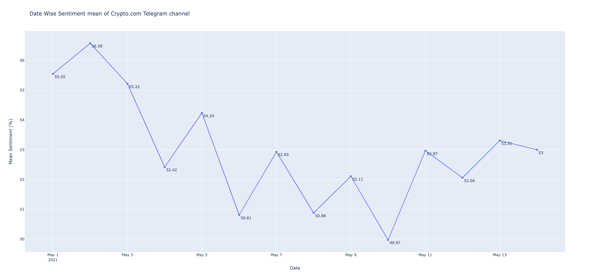

## Instructions to run the code
1. Install the dependencies:
    * python3 -m pip install -r requirements.txt
2. Run the python script:
    * python3 main.py
3. All necessary files (crypto_data.json, requirements.txt) are available in the same directory as main.py

## Code Description

1. NLTK English word corpus was used to create list of english words and a few social media slangs were added to the corpus
2. By checking the intersection between the message and the above corpus, if atleast 1/3rd of the words in the message exist in the corpus, we tag it as a english
3. Note that we have considered only sentences containing shib/doge for the above process so that pre-processing is done only on necessary data
4. Emojis were converted to the actual english words so that the sentiment analyser can analyse the sentiment in the emoji as well
5. Computing the sentiment of the message is done by using NLTK VADER, because it is built for usecases pertaining to messages on social media, and the function returns a compound score which is in the range of -1 to 1 determining the sentiment of the message. Post that the compound value is scaled from 0-100.
6. Finally the results were aggregated and plotted using Plotly

## Results and Analysis

1. Exported dataset contains 47232 messages in all
2. Data contains 2900 English and 42 Non-English messages containing the words shib or doge in any possible case
3. We notice that Sentiment Score is high on 2nd May (56.58%) but the number of messages is very low to give it sufficient weightage
4. Among the days with substantial messages, we notice that the Sentiment score reached the highest of 54.24% on 5th May and the lowest of 49.97% on 10th May
5. Plot : result_plot.png, Aggregate numbers : result_data.csv

